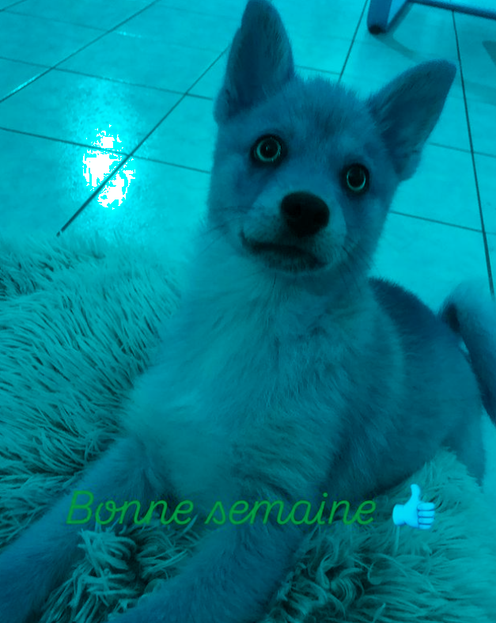

# 🐣 S1 | Prog: Workshop

J'ai choisis de modifier une magnifique image de mon chien.
Regarde comme il est beau :


# Table des matières

- [🐣 S1 | Prog: Workshop](#-s1--prog-workshop)
- [Table des matières](#table-des-matières)
  - [Exercice QUE DU VERT](#exercice-que-du-vert)
  - [Exercice ECHANGER LES CANAUX](#exercice-echanger-les-canaux)
  - [Exercice NOIR ET BLANC](#exercice-noir-et-blanc)
  - [Exercice NEGATIF](#exercice-negatif)
  - [Exercice DEGRADE](#exercice-degrade)
  - [Exercice MIROIR](#exercice-miroir)
  - [Exercice SYMETRIE :](#exercice-symetrie-)
  - [Exercice ROTATION 90 :](#exercice-rotation-90-)
  - [Exercice RGB split](#exercice-rgb-split)
  - [Exercice LUMINOSITE](#exercice-luminosite)
  - [Exercice DISQUE](#exercice-disque)
  - [Exercice CERCLE](#exercice-cercle)
  - [Exercice ROSACE](#exercice-rosace)
  - [Exercice MOSAIQUE](#exercice-mosaique)
      - [Exercice MOSAÏQUE](#exercice-mosaïque)
  - [Exercice GLITCH](#exercice-glitch)
  - [Exercice FRACTALE DE MANDELBROT](#exercice-fractale-de-mandelbrot)
  - [Exercice FRACTALE DE MANDELBROT](#exercice-fractale-de-mandelbrot-1)
  - [Exercice VORTEX](#exercice-vortex)
  - [Exercice CONVOLUTIONS](#exercice-convolutions)


## Exercice QUE DU VERT

Dans cet exercice, nous appliquons un algorithme qui met les constantes rouges et bleus à 0, ce qui permet de ne garder que le vert plus ou moins foncé dans l'image ;)

```cpp
void keep_green_only(sil::Image &image)
{
    for (glm::vec3 &color : image.pixels())
    {
        color.r = 0.f;
        color.b = 0.f;
    }

    image.save("output/output_off/volf_vert.png");
}
```

Image modifiée :


## Exercice ECHANGER LES CANAUX

On inverse juste les constantes rouges et bleues

```cpp
void swap_canaux(sil::Image &img)
{
    for (glm::vec3 &color : img.pixels())
    {
        int temp = color.r;
        color.b = color.r;
        color.r = temp;
    }
    img.save("output/output_off/volf_swap.png");
}
```


Résultat :




## Exercice NOIR ET BLANC

Pour faire du noir et blanc (ou plutôt une image en nuances de gris), il suffit de multiplier les constantes rouge, bleue et verte de chaque pixel par un coefficient bien précis : **0.2126** pour le rouge, **0.7152** pour le vert et **0.0722** pour le bleu.

```cpp
void noir_blanc(sil::Image &img)
{
    for (int x = 0; x < img.width(); x++)
    {
        for (int y = 0; y < img.height(); y++)
        {
            float gray = img.pixel(x, y).r * 0.2126f + img.pixel(x, y).g * 0.7152f + img.pixel(x, y).b * 0.0722f;
            img.pixel(x, y).r = img.pixel(x, y).g = img.pixel(x, y).b = gray;
        }
    }

    img.save("output/output_off/volf_noir_et_blanc.png");
}
```

Résultat :


## Exercice NEGATIF

On fait pour chaque constante (RGB), le maximum (1.0f) moins la constante actuelle.

```cpp
void negatif(sil::Image &img)
{
    for (glm::vec3 &color : img.pixels())
    {
        color = 1.f - color;
    }

    img.save("output/output_off/volf_negatif.png");
}
```

Résultat :


## Exercice DEGRADE

On prend les mêmes valeurs pour les constantes RGB que l'on augmente en fonction du déplacement vertical.

```cpp

void degrade()
{
    sil::Image image{300 /*width*/, 200 /*height*/};

    for (int x{0}; x < image.width(); x++)
    {
        for (int y{0}; y < image.height(); y++)
        {
            float valeur = static_cast<float>(x) / static_cast<float>(image.width() - 1);

            image.pixel(x, y).r = image.pixel(x, y).g = image.pixel(x, y).b = valeur;
        }
    }

    image.save("output/output_off/degrade.png");
}

```
Résulat :


## Exercice MIROIR

On recréer une image puis on inverse les pixels sur l'axe x.

```cpp
void miroir(sil::Image &img)
{
    sil::Image newImg = img;
    for (int x{0}; x < img.width(); x++)
    {
        for (int y{0}; y < img.height(); y++)
        {
            img.pixel(x, y).r = newImg.pixel(img.width() - (x + 1), y).r;
            img.pixel(x, y).b = newImg.pixel(img.width() - (x + 1), y).b;
            img.pixel(x, y).g = newImg.pixel(img.width() - (x + 1), y).g;
        }
    }

    img.save("output/output_off/volf_miroir.png");
}
```

Résultat :


## Exercice SYMETRIE :

En essayant l'exercice miroir, je me suis trompé, cela à créer une symétrie axial verticale. J'ai également fait une symétrie axial horizontal puis les deux combinés.

```cpp
void symetrie_axial_verticale(sil::Image &img)
{
    for (int x{0}; x < img.width(); x++)
    {
        for (int y{0}; y < img.height(); y++)
        {
            img.pixel(x, y).r = img.pixel(img.width() - (x + 1), y).r;
            img.pixel(x, y).b = img.pixel(img.width() - (x + 1), y).b;
            img.pixel(x, y).g = img.pixel(img.width() - (x + 1), y).g;
        }
    }

    img.save("output/output_off/volf_symetrie_verticale.png");
}

void symetrie_axial_horizontale(sil::Image &img)
{
    for (int x{0}; x < img.width(); x++)
    {
        for (int y{0}; y < img.height(); y++)
        {
            img.pixel(x, y).r = img.pixel(x, img.height() - (y + 1)).r;
            img.pixel(x, y).b = img.pixel(x, img.height() - (y + 1)).b;
            img.pixel(x, y).g = img.pixel(x, img.height() - (y + 1)).g;
        }
    }

    img.save("output/output_off/volf_symetrie_horizontale.png");
}

```

Symétrie vertical :


Symétrie horizontale :


Combinaison :


## Exercice ROTATION 90 :

On créer une nouvelle image dont la largeur est la hauteur de l'image de base et dont la hauteur et la largeur. 

```cpp
void rotation90(sil::Image &image)
{
    sil::Image newImg{image.height(), image.width()};
    
    for (int x{0}; x < image.width(); x++)
    {
        for (int y{0}; y < image.height(); y++)
        {
            int newX = image.height() - 1 - y;
            int newY = x;

            newImg.pixel(newX, newY).r = image.pixel(x, y).r;
            newImg.pixel(newX, newY).g = image.pixel(x, y).g;
            newImg.pixel(newX, newY).b = image.pixel(x, y).b;
        }
    }

    newImg.save("output/output_off/volf_tourne_la_tete.png");
}
```

Résultat :


## Exercice RGB split

Pour chaque pixel, on prend le rouge d'un pixel à sa droite, le bleur d'un pixel à sa gauche et son propre vert.

```cpp
void rgbsplit(sil::Image image)
{
    sil::Image newImg{image.width(), image.height()};
    for (int x{0}; x < image.width(); x++)
    {
        for (int y{0}; y < image.height(); y++)
        {
            newImg.pixel(x, y).g = image.pixel(x, y).g;
            if (x >= 20)
            {
                newImg.pixel(x, y).b = image.pixel(x - 18, y).b;
            }
            if (x <= image.width() - 20)
            {
                newImg.pixel(x, y).r = image.pixel(x + 18, y).r;
            }
        }
    }
    newImg.save("output/output_off/volf_plein_de_couleurs.png");
}
```

Résultat :


## Exercice LUMINOSITE

On applique la fonction puissance à chaque constante (RGB). Une puissance > 1 donnera une image plus foncée et < 1 donnera une image plus claire

```cpp
void luminosite(sil::Image &image)
{
    for (int x{0}; x < image.width(); x++)
    {
        for (int y{0}; y < image.height(); y++)
        {
            image.pixel(x, y).r = std::pow(image.pixel(x, y).r, 1.2f);
            image.pixel(x, y).g = std::pow(image.pixel(x, y).g, 1.2f);
            image.pixel(x, y).b = std::pow(image.pixel(x, y).b, 1.2f);
        }
    }

    image.save("output/output_off/volf_plus_fonce.png");
}
```

Résultat plus foncé :


Résultat plus clair :


## Exercice DISQUE

On applique la formule d'un disque pour savoir si le pixel fait parti du disque, si oui on le colore en blanc.

```cpp
void disque(int rayon, int xcentre, int ycentre, int num)
{
    sil::Image image{500 /*width*/, 500 /*height*/};
    for (int x = 0; x < image.width(); x++)
    {
        for (int y = 0; y < image.height(); y++)
        {
            if (std::pow(x - xcentre, 2) + std::pow(y - ycentre, 2) <= std::pow(rayon, 2))
            {
                image.pixel(x, y).r = image.pixel(x, y).b = image.pixel(x, y).g = 0.2f;
            }
        }
    }
    std::string chemin = "output/cercles/pouet" + std::to_string(num) + ".png";
    image.save(chemin);
}
```

Ici ma fonction permet d'exporter plusieurs disques afin de créer une image GIF.

Résultat :


## Exercice CERCLE

Quasiment la même chose que pour le disque mais on vérifie 2 conditions pour le colorer : que le point soit dans un disque et en dehors de l'autre.

```cpp
void cercle(int thickness)
{
    sil::Image image{500 /*width*/, 500 /*height*/};
    int rayon = 125;
    int xcentre = image.width() / 2;
    int ycentre = image.height() / 2;
    for (int x = 0; x < image.width(); x++)
    {
        for (int y = 0; y < image.height(); y++)
        {
            if (std::pow(x - xcentre, 2) + std::pow(y - ycentre, 2) <= std::pow(rayon, 2) and std::pow(x - xcentre, 2) + std::pow(y - ycentre, 2) >= std::pow(rayon - thickness, 2))
            {
                image.pixel(x, y).r = 0.8f;
                image.pixel(x, y).b = image.pixel(x, y).g = 0.2f;
            }
        }
    }
    image.save("output/output_off/juste_un_cercle.png");
}
```

Résultat :


## Exercice ROSACE

On met un cercle sur chaque i*pi/3 pour i allant de 1 à 6. Puis on convertit les coordonnées polaire en coordonnées cartésiennes.

```cpp
void rosace(int thickness, int rayon)
{
    // x = rcos teta
    // y = rsin teta
    // avec r le rayon du cercle
    // un cercle centre, un a 0, un a pi3, un a 2pi/3, un a 3pi/4,...

    constexpr double pi = 3.14159265358979323846;

    sil::Image image{500, 500};
    cercle_rosace(thickness, image, rayon, image.width() / 2, image.height() / 2);
    for (int i = 0; i < 6; i++)
    {
        cercle_rosace(thickness, image, rayon, image.width() / 2 + rayon * std::cos(i * pi / 3), image.width() / 2 + rayon * std::sin(i * pi / 3));
    }
    image.save("output/output_off/belle_rosace.png");
}
```

Résultat :


## Exercice MOSAIQUE

On reconstruit une image de la taille qu'on veut (n fois longueur de l'image de base et n fois la hauteur de l'image de base). Puis un recopie l'image.

```cpp
void mosaique(sil::Image &img, int nb_image)
{
    sil::Image newImg{nb_image * img.width(), nb_image * img.height()};

    for (int i = 0; i < nb_image; ++i)
    {
        for (int j = 0; j < nb_image; ++j)
        {
            for (int xi = 0; xi < img.width(); ++xi)
            {
                for (int yi = 0; yi < img.height(); ++yi)
                {
                    int targetX = i * img.width() + xi;
                    int targetY = j * img.height() + yi;

                    newImg.pixel(targetX, targetY) = img.pixel(xi, yi);
                }
            }
        }
    }

    newImg.save("output/output_off/volf_plein_de_fois.png");
}
```

Résultat :


#### Exercice MOSAÏQUE

Comme la mosaique mais on inverse une image sur deux

```cpp
void mosaique_miroir(sil::Image &img, int nb_image)
{
    sil::Image newImg{nb_image * img.width(), nb_image * img.height()};

    for (int i = 0; i < nb_image; ++i)
    {
        for (int j = 0; j < nb_image; ++j)
        {

            for (int xi = 0; xi < img.width(); ++xi)
            {
                for (int yi = 0; yi < img.height(); ++yi)
                {
                    int sourceX = xi;
                    int sourceY = yi;

                    if (i % 2 == 1)
                    {
                        sourceX = img.width() - 1 - xi;
                    }
                    if (j % 2 == 1)
                    { 
                        sourceY = img.height() - 1 - yi;
                    }

                    
                    int targetX = i * img.width() + xi;
                    int targetY = j * img.height() + yi;

                    newImg.pixel(targetX, targetY) = img.pixel(sourceX, sourceY);
                }
            }
        }
    }

    newImg.save("output/output_off/volf_plein_de_fois_mais_de_maniere_rigolote.png");
}
```


## Exercice GLITCH

On prend aléatoirement des rectangles de longeur et largeur aléatoires dans l'image puis on les échanges avec des rectangles de même dimension autre part dans l'image.

```cpp
void glitch(sil::Image &img)
{
    for (int x = 0; x < img.width(); x++)
    {
        for (int y = 0; y < img.height(); y++)
        {
            if (true_with_probability(0.0003f))
            {
                int longueur_rec = random_int(10, 40);
                int largeur_rec = random_int(3, 10);

                longueur_rec = std::min(longueur_rec, img.width() - x);
                largeur_rec = std::min(largeur_rec, img.height() - y);

                sil::Image img_temp{longueur_rec, largeur_rec};
                for (int i = 0; i < longueur_rec; i++)
                {
                    for (int j = 0; j < largeur_rec; j++)
                    {
                        img_temp.pixel(i, j) = img.pixel(x + i, y + j);
                    }
                }

                int posx_alea = random_int(0, img.width() - longueur_rec);
                int posy_alea = random_int(0, img.height() - largeur_rec);

                for (int ii = 0; ii < longueur_rec; ii++)
                {
                    for (int jj = 0; jj < largeur_rec; jj++)
                    {
                        img.pixel(x + ii, y + jj) = img.pixel(posx_alea + ii, posy_alea + jj);
                        img.pixel(posx_alea + ii, posy_alea + jj) = img_temp.pixel(ii, jj);
                    }
                }
            }
        }
    }

    img.save("output/output_off/volf_ca_gresille.png");
}
```

Résultat :


## Exercice FRACTALE DE MANDELBROT

On itère un nombre complexe z avec z = z^2 + c avec c le nombre complexe résultant des coordonnées x et y du pixel en court.

```cpp
void mandelbrot()
{
    sil::Image image{500 /*width*/, 500 /*height*/};
    // 1/125x-2
    int iteration{50};
    for (int x = 0; x < image.width(); x++)
    {
        for (int y = 0; y < image.height(); y++)
        {
            int i{0};
            std::complex<float> z_init{0.f, 0.f};
            float real = (float(x) / image.width()) * (1.f - (-2.f)) + (-2.f);
            float imag = (float(y) / image.height()) * (1.f - (-1.f)) + (-1.f);
            std::complex<float> c{real, imag};

            while (i < iteration and std::abs(z_init) < 2)
            {
                z_init = z_init * z_init + c;
                i++;
                // std::cout << z_init << "\n";
            }

            if (std::abs(z_init) < 2 or i < iteration)
            {
                image.pixel(x, y).r = image.pixel(x, y).g = image.pixel(x, y).b = (float)i / iteration;
            }
            else
            {
                image.pixel(x, y).r = image.pixel(x, y).g = image.pixel(x, y).b = 0.f;
            }
        }
    }
    image.save("output/output_off/pain_d_amande.png");
}
```

Résultat :


## Exercice FRACTALE DE MANDELBROT

En utilisant une matrice on peut simuler la présence de nuances de gris.

```cpp
void tramage(sil::Image img, float bayer_r, int i)
{
    const int bayer_n = 4;
    float bayer_matrix_4x4[][bayer_n] = {
        {-0.5, 0, -0.375, 0.125},
        {0.25, -0.25, 0.375, -0.125},
        {-0.3125, 0.1875, -0.4375, 0.0625},
        {0.4375, -0.0625, 0.3125, -0.1875},
    };
    // float bayer_r = 0.9f; // Valeur maximale pour le Bayer

    for (int sy = 0; sy < img.height(); sy++)
    {
        for (int sx = 0; sx < img.width(); sx++)
        {
            float orig_color = img.pixel(sx, sy).r;
            float bayer_value = bayer_matrix_4x4[sy % bayer_n][sx % bayer_n];
            float output_color = orig_color + (bayer_r * bayer_value);

            float color_result = 0.f;
            if (output_color >= (bayer_r / 2))
            {
                color_result = 1.f;
            }

            img.pixel(sx, sy).r = img.pixel(sx, sy).g = img.pixel(sx, sy).b = color_result;
        }
    }

    img.save("output/tramages/tramage" + std::to_string(i) + ".png");
}
```

Résultat :
J'ai choisis de refaire un GIF avec différentes valeur de gamme de couleurs.


## Exercice VORTEX

On utilise une fonction qui tourne un pixel en fonction de la distance avec le centre de l'image.

```cpp
void vortex(sil::Image &img)
{
    constexpr double pi = 3.14159265358979323846;

    glm::vec2 centre(img.width() / 2.0, img.height() / 2.0); // Centre de l'image

    sil::Image source = img;

    for (int x = 0; x < img.width(); x++)
    {
        for (int y = 0; y < img.height(); y++)
        {
            glm::vec2 point(x, y);
            int distance{glm::distance(centre, point)};
            float angle = 0.006 * distance;

            glm::vec2 rotatedPoint = rotated(point, centre, angle);
            // std::cout << rotatedPoint.x << rotatedPoint.y << " , \n";

            int rx = static_cast<int>(std::round(rotatedPoint.x));
            int ry = static_cast<int>(std::round(rotatedPoint.y));
            if (rx >= 0 && rx < img.width() && ry >= 0 && ry < img.height())
            {
                img.pixel(x, y) = source.pixel(rx, ry);
            }
            else
            {
                img.pixel(x, y).r = img.pixel(x, y).g = img.pixel(x, y).b = 0.f; // Noir
            }
        }
    }

    img.save("output/output_off/volf_bourre.png");
}
```

Résultat :


## Exercice CONVOLUTIONS

Les convolutions permettent d'appliquer plusieurs filtres sur des images en fonction d'un tableau de tableau permettant d'appliquer des poids différents au pixel que l'on traite ainsi qu'aux 9 pixels qui l'entoure.

Exemple :


Ici c'est fait en noir et blanc et permet d'obtenir les contours de l'image mais il est possible d'appliquer ça sur des images en couleurs en faisant la même opération sur les constantes RGB.


```cpp
void convolution(sil::Image &img, const std::vector<std::vector<float>> &kernel)
{
    sil::Image result = img;

    int kernel_size = kernel.size();
    std::cout << kernel_size;
    int offset = kernel_size / 2; // Déplacement pour correspondre au centre du noyau

    for (int x = offset; x < img.width() - offset; x++)
    {
        for (int y = offset; y < img.height() - offset; y++)
        {
            float const_r = 0.f;
            float const_g = 0.f;
            float const_b = 0.f;

            for (int i = -offset; i <= offset; i++)
            {
                for (int j = -offset; j <= offset; j++)
                {
                    float poid = kernel[i + offset][j + offset];

                    const_r += poid * img.pixel(x + i, y + j).r;
                    const_g += poid * img.pixel(x + i, y + j).g;
                    const_b += poid * img.pixel(x + i, y + j).b;
                }
            }

            result.pixel(x, y).r = clamp(const_r, 0.f, 255.f); // Clamp pour éviter les débordements
            result.pixel(x, y).g = clamp(const_g, 0.f, 255.f);
            result.pixel(x, y).b = clamp(const_b, 0.f, 255.f);
        }
    }

    result.save("output/output_off/volf_gravure_sur_pierre.png");
}
```

Résultat avec un filtre 'emboss' :


